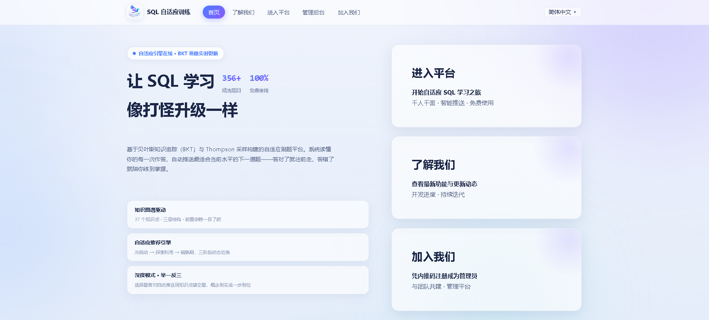
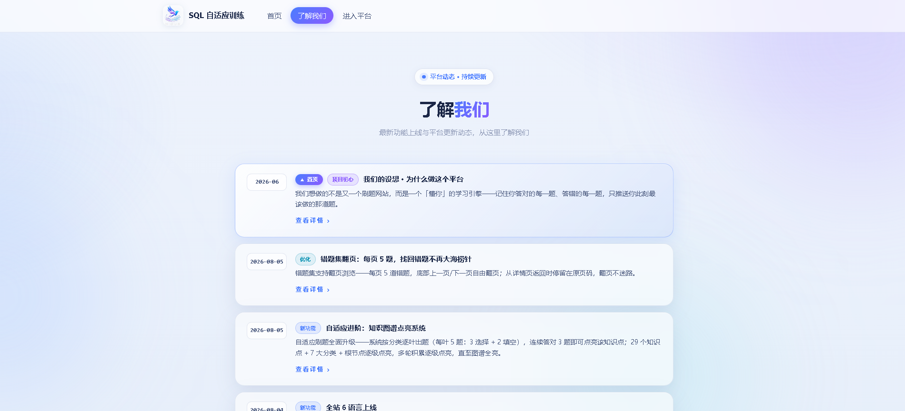
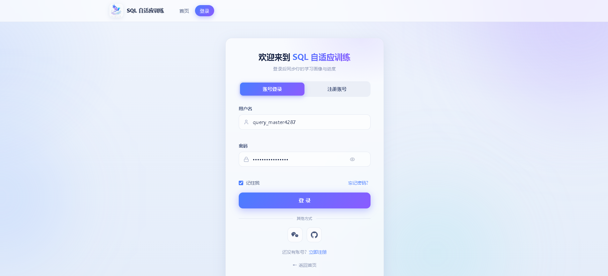
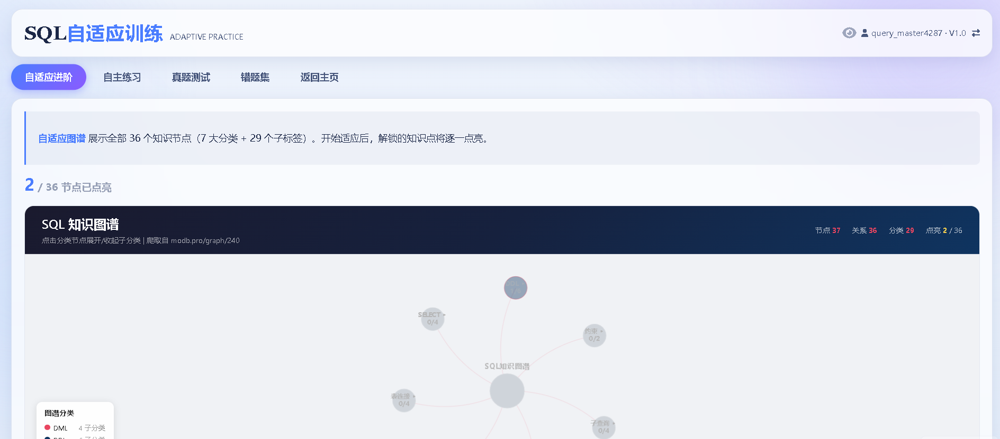

# SQL 自适应训练平台

基于知识图谱点亮机制与自适应出题算法的 SQL 练习平台。练习题库 58 题（基础/进阶选择题）+ 真题库 42 题（牛客经典 SQL 填空题），覆盖基础语法、连接查询、子查询、聚合、窗口函数等常见知识点，练习进度通过知识图谱可视化呈现。

## 界面预览

**主页** — 门户入口，支持 6 语言切换



**了解我们** — 更新动态与项目初心



**登录注册** — 随机用户名与安全密码生成



**刷题** — 自适应进阶与答题界面



## 功能

- 知识图谱三级点亮：知识点按叶 / 枝 / 根组织，答对题目点亮节点，进度可视化
- 自适应出题：每轮按「选择题 ×3 + 填空题 ×2」组织 5 题序列，跨练习池累计答对即点亮节点（幂等落库）
- SQL 判题：SQL 规范化、只读单语句校验、沙箱执行、结果集比对
- 题库：练习题库 58 题（29 道基础选择题 + 29 道进阶选择题，进阶题带建表数据与预期输出）+ 真题库 42 道经典 SQL 填空题（牛客风格，覆盖全部 29 个知识标签），完整题库备份于 `questions_full.json` / `exam_questions_full.json`
- 学习闭环：水平诊断 → 自适应练习 → 错题集 → 图谱点亮 → 进阶选题
- 账号体系：注册 / 登录 / GitHub 一键登录（OAuth2，可选）/ 会话管理 / 管理员面板（统一密钥 + 邀请码）
- 前端无框架依赖，图表库本地化，支持离线部署
- 一键启动：自动探测并安装 Python、安装依赖、启动服务并打开浏览器

## 技术栈

- 后端：Python / Flask / SQLite
- 前端：原生 HTML / CSS / JS，ECharts（本地化资源）
- 判题：自研 SQL 规范化 + 沙箱执行比对
- 测试：pytest（123 用例）

## 快速开始

### Windows 一键启动

```bat
start_server.bat
```

脚本自动完成：探测可用 Python（缺失时自动下载安装）→ 安装依赖 → 启动服务 → 打开浏览器 `http://localhost:5000`

### 手动启动

```bash
# 安装依赖
pip install -r backend/requirements.txt

# 初始化题库
python backend/seeding.py

# 启动服务
python backend/run.py
# 访问 http://localhost:5000
```

## GitHub 一键登录（可选）

登录页的 GitHub 按钮走 OAuth2 授权码模式，免费注册即可启用：

1. [github.com/settings/developers](https://github.com/settings/developers) → **New OAuth App**（注意是 OAuth App，不是 GitHub App）
2. Application name 任意；Homepage URL 填 `http://localhost:5000`；**Authorization callback URL 填 `http://localhost:5000/api/oauth/github/callback`**（须与后端逐字符一致）；Enable Device Flow 不勾选
3. 创建后复制 **Client ID**，点击 **Generate a new client secret** 生成 **Client Secret**（只显示一次，当场保存）
4. 在 `backend/oauth_config.json` 中填写（已 gitignore，模板见 `backend/oauth_config.example.json`）：

```json
{ "github_client_id": "Ov1.xxxx", "github_client_secret": "xxxx" }
```

也可用环境变量 `GITHUB_OAUTH_CLIENT_ID` / `GITHUB_OAUTH_CLIENT_SECRET` 覆盖（优先级更高，服务器部署用）。

行为说明：

- GitHub 用户名与现有注册用户重名时自动加 `_gh` 后缀，互不影响；同一 GitHub 账号反复登录复用同一 `session_id`，进度连续
- GitHub 账号不可走密码登录（密码为随机哈希）；管理员在面板中对该账号重置密码后可转为密码登录
- GitHub OAuth App 只支持**一个**回调地址：改用 ngrok / 正式域名部署时，需同时更新 GitHub 后台的回调 URL 与本地启动地址，否则授权回跳指向 localhost

## 目录结构

```
├── backend/               # Flask 后端
│   ├── app.py             # 路由 / API / 鉴权
│   ├── engine.py          # 自适应出题引擎（图谱点亮）
│   ├── sql_judge.py       # SQL 判题引擎
│   ├── seeding.py         # 题库种子重建
│   ├── scraper.py         # 题库抓取工具
│   ├── oauth.py           # GitHub OAuth 登录（配置 / 授权码流程 / 建档）
│   └── tests/             # pytest 测试套件（144 用例）
├── frontend/              # 前端页面（原生 HTML/CSS/JS）
│   ├── index.html         # 首页
│   ├── knowledge_map.html # 知识图谱点亮视图
│   ├── diagnostic.html    # 水平诊断
│   └── admin*.html        # 管理面板
├── docs/                  # 设计文档与规范
├── questions.json         # 练习题库数据源（58 题选择题；完整题库备份于 questions_full.json）
├── exam_questions.json    # 真题库数据源（42 题牛客 SQL 填空题；完整题库备份于 exam_questions_full.json）
└── start_server.bat       # 一键启动脚本
```

## 测试

```bash
cd backend
pytest -v        # 144 个用例全绿
```

覆盖：SQL 判题、图谱点亮规则、学习流程、种子重建、API 安全、GitHub OAuth 登录。

## 文档

- [知识图谱设计](docs/knowledge_map.md)
- [题目格式规范](docs/format_spec.md)

## 说明

- 数据库（`backend/questions.db`）由题库数据源重建，不随仓库分发
- 服务端密钥走环境变量 / 数据库存储，不硬编码于代码；GitHub OAuth 凭证走环境变量或 `backend/oauth_config.json`（均不随仓库分发）
